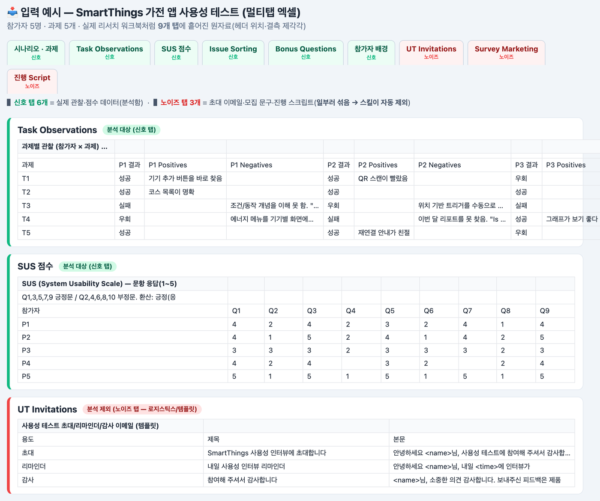
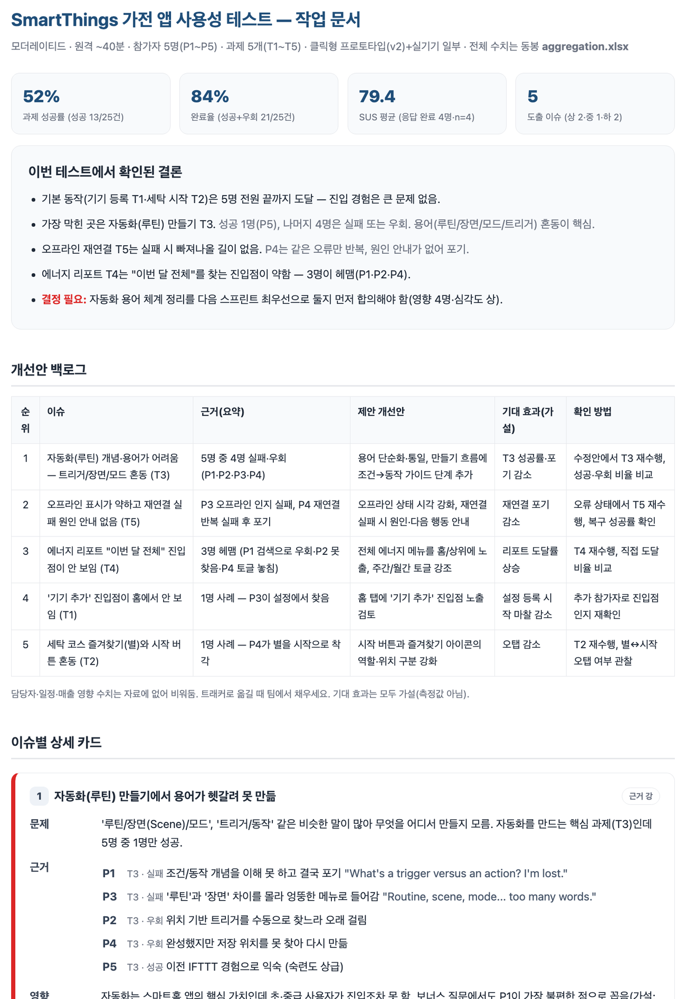

# 🔍 User Insight Generator (사용자 인사이트 생성기)

수십 페이지의 사용성 평가·UX 리서치 **원자료(raw data)**를 실무에 바로 투입 가능한 **'작업용 HTML 문서'**와 **'수치 집계 엑셀(.xlsx)'**로 변환하는 Claude 스킬입니다.

길고 지루한 분석가용 보고서가 아닙니다. 제품팀이 회의·JIRA 백로그·개발 협의에 즉시 복사-붙여넣기할 수 있도록 철저히 **실행(Action) 중심**으로 요약하되, 모든 주장을 **원자료 근거에 추적 가능**하게 묶습니다.

> **스킬 식별자:** 리포지토리/브랜드명은 *User Insight Generator*지만, `SKILL.md`의 실제 `name:`은 **`usability-research-synthesizer`**입니다(트리거·등록 시 이 이름 사용).

---

## 📸 미리보기 (입력 → 출력)

**① 입력:** 실제 리서치 워크북처럼 **9개 탭(신호 6 + 노이즈 3)**에 흩어진 엑셀 원자료. 초대 이메일·모집 문구·진행 스크립트 같은 **노이즈 탭을 일부러 섞어도**, 스킬이 관찰/점수 탭(Task Observations·SUS·Issue Sorting)만 골라 분석합니다.

**② 출력:** 같은 엑셀에서 나온 **실행용 HTML 리포트**. 상단 지표 타일 → 결론 요약 → JIRA용 백로그 표 → 근거가 **'한 사람=한 줄'**로 붙은 이슈 카드. SUS 결측(P4)은 날조 없이 **n=4 기준**으로 처리하고, 노이즈 탭 내용은 결과에 전혀 섞이지 않습니다. (📄 [전체 리포트 캡처](docs/report-output-full.png) · 정량 집계는 별도 `.xlsx`로 동시 출력)

---

## 🧭 빠르게 이해하기 (리포지토리 지도)

> 이 스킬을 처음 보는 사람/에이전트가 **전체를 다 읽지 않고** 필요한 파일만 펴보도록 만든 지도입니다.
> 진입점은 항상 **`SKILL.md`** 하나 — 나머지는 거기서 가리키는 대로 필요할 때만 읽습니다(progressive disclosure).

| 경로 | 역할 | 언제 읽나 |
| --- | --- | --- |
| **`SKILL.md`** | 메인 지시문. 워크플로우 / 근거 규칙 요약 / 적응형 분석 선택 / 산출물 정의 / HTML 보고서 구조 | **여기부터.** 스킬 동작의 80%는 이 파일에 있음 |
| `references/evidence-grounding.md` | 관찰·해석·제안 3계층, 날조 금지 규칙, 근거 있는/없는 표현 예시 | **findings 작성 전 필독.** "지어내지 않기"의 세부 규칙 |
| `references/html-report-patterns.md` | HTML 리포트 구조·카드/백로그 레이아웃·가독성 패턴·스타일·자체완결 제약 | HTML 리포트를 만들거나 가독성을 고칠 때 |
| `references/slide-deck-patterns.md` | (옵션) 발표용 슬라이드 덱 형식 — 언제 전환할지, 레이아웃 모듈(표지/섹션/2단/통계/마무리), JS 없이도 되는 내비게이션, 인쇄용 CSS | "슬라이드/덱/발표용으로 만들어줘" 요청이 들어왔을 때 |
| `references/analysis-patterns.md` | 데이터 유형별(정성/행동/정량/얇은 입력/기존 보고서) 분석 방법 선택 | 어떤 분석을 적용할지 정할 때 |
| `references/research-principles.md` | 정성 vs 정량, why-not-just-what, 표본 겸손, 심각도 vs 확신도 | 해석의 균형/이해관계자 프레이밍이 필요할 때 |
| `references/maze-methodology-notes.md` | SUS/SEQ 등 지표 정의, 어피니티, 이해관계자 buy-in (Maze 글에서 원칙만 차용) | 지표 환산·정의를 확인할 때 |
| `evals/evals.json` | 검증용 테스트 프롬프트 5종 + 논트리거 3종 (각 assertion 포함) | 스킬 변경 후 회귀 검증/품질 기준을 볼 때 |
| `evals/sample-inputs/` | 샘플 원자료: 사용성 메모(md) · 인터뷰(md) · 얇은 설문(txt) · **멀티탭 엑셀(xlsx)** | 테스트를 직접 돌려볼 때 |
| `examples/` | 실제 산출물 예시: HTML 리포트 2종 + 집계 xlsx 2종 + **발표용 슬라이드 덱 1종** | 최종 결과물이 어떤 모습인지 볼 때 |

---

## 💡 동작 원리 핵심 (5가지만 알면 됨)

1. **근거 3계층을 항상 분리한다.** **관찰**(원자료에 직접 있는 것: 인용·미스클릭·과제 실패·지표) → **해석**(관찰에서 합리적으로 추론한 것, "해석"으로 라벨) → **제안**(근거가 뒷받침할 때만). 이 추적 가능성이 스킬의 신뢰성 전부다. (`evidence-grounding.md`)
2. **산출물은 두 개, 데이터에 맞춰 낸다.** 정량값이 있으면 **완전한 집계 `.xlsx`**(모든 수치 누락 없이) + **실행용 HTML 리포트**(고칠 것 중심, 근거는 부록). 정성/얇은 입력이면 HTML(또는 짧은 요약)만. "슬라이드로/발표용으로 만들어줘"처럼 명시적으로 요청하면 더 압축된 **발표용 슬라이드 덱**(`slide-deck-patterns.md`)으로도 만들 수 있다 — 기본값은 아니다.
3. **분석을 데이터에 맞춘다(고정 템플릿 금지).** 인터뷰면 테마·어피니티, 과제 로그면 마찰·심각도, 지표면 수치+그걸 설명하는 정성 근거, 얇으면 "말할 수 있는 것/없는 것"을 솔직히. (`analysis-patterns.md`)
4. **HTML은 '연구 보고서'가 아니라 '작업 문서'.** 결론 요약 → 백로그 표(한눈 요약) → 이슈 상세 카드(순위 포함) → 과제 요약 → 근거 부록(접이식). 가독성 규칙: 근거는 **한 사람=한 줄** 리스트, 라벨↔값 2열 그리드, 이탤릭 금지, 색은 의미당 하나. (`html-report-patterns.md`)
5. **멀티탭 엑셀 입력은 트리아지부터.** 실제 리서치 워크북은 관찰/점수 탭(Task Observations·SUS·Issue Sorting)과 로지스틱스/템플릿 탭(초대 이메일·모집 문구·진행 스크립트)이 섞여 있음 → **후자는 분석에서 제외**, 빈 셀은 값이 아니라 "수집 안 됨". (`SKILL.md`의 Inspect 단계)

> **한 줄 요약:** *근거에 100% 묶인 채로, 데이터 모양에 맞춰, 제품팀이 5분 안에 실행으로 옮길 수 있는 문서를 만든다.*

---

## ✨ 특징

* **팩트 기반 (Zero Hallucination):** 없는 사실(참가자 수·인용·지표·과제명·기능·매출 영향)을 절대 지어내지 않음. 모르면 "수집 안 됨"으로 표기.
* **실행 중심 + 추적 가능:** 본문은 이슈·제안에 집중, 방법론과 전체 근거는 부록으로. 그러면서 모든 주장은 근거로 되짚을 수 있음.
* **적응형:** 자료의 종류·품질·풍부함에 따라 분석법과 보고서 구조를 스스로 선택.
* **멀티탭 엑셀 대응:** 여러 탭에 흩어진 원자료를 훑어 신호/노이즈 탭을 자동 구분.
* **한국어 기본:** 산출물은 한국어, 단 **참가자 인용은 원문 그대로** 보존(번역·수정 금지).

---

## 📑 출력 HTML 리포트 구조

실행 중심 '작업 문서' 척추 (자료에 맞춰 변형):

1. **이번 테스트에서 확인된 결론** — 한 줄짜리 핵심 takeaway 3~5개
2. **개선안 백로그** — JIRA/PLM에 바로 옮기는 한눈 요약 표 (= 우선순위 리스트 겸함)
3. **이슈별 상세 카드** — 순위 포함 / 문제·근거·영향·제안·확인 방법·근거 수준
4. **과제별 결과 요약** — 성공/실패/머뭇거림/우회
5. **근거 부록** — 참가자별 원자료·인용·지표 (접이식)
6. **추가 확인 필요사항** — 부족한 지표, 약한 근거, 후속 질문

> 정성-only 자료는 '이슈' 자리에 '주제/사용자 니즈'가 들어가고, 얇은 입력은 결론+갭만.

---

## ✅ 검증 (evals)

`evals/evals.json`에 테스트 케이스 4종이 있고, 각 케이스는 `sample-inputs/`의 실제 입력과 assertion을 가집니다.

| # | 케이스 | 검증 초점 |
| --- | --- | --- |
| 0 | 사용성 테스트(행동 데이터) | 과제 마찰·심각도/확신도 분리·인용 정확성 |
| 1 | 인터뷰(정성) | 상향식 테마·세그먼트 차이·해석 라벨링 |
| 2 | 얇은 설문 | 완료율 날조 거부·근거 부족 명시 |
| 3 | **멀티탭 엑셀(정량+노이즈 탭)** | 탭 트리아지·집계 완전성·결측 처리·가독성 패턴 |

논트리거 케이스 3종(리서치 설계, A/B 통계, 데이터 클리닝)도 포함 — 스킬이 **언제 작동하지 말아야 하는지**까지 규정.

---

## 🚀 설치 (Claude.ai / Claude Code)

1. **다운로드:** 우측 상단 초록 `Code` → **Download ZIP** 후 압축 해제 (또는 `git clone`).
2. **업로드:** [Claude.ai](https://claude.ai) → `Settings` → `Capabilities` > `Skills` → `Upload skill` → 스킬 폴더 선택 → 토글 ON.
3. **사용:** 리서치 원자료(텍스트·PDF·엑셀 등)를 첨부하고 요청:
   > "첨부한 체크아웃 사용성 테스트 결과를 분석해서 제품팀에 공유할 보고서랑 지표 엑셀을 만들어줘."

---

### 📚 출처 및 방법론

Maze의 이해관계자 buy-in 전략, 어피니티 다이어그램, 사용성 지표, 정성 리서치 가이드에서 **'핵심 원칙'만** 차용해 설계(구조를 그대로 복제하지 않음). 자세한 출처는 `references/maze-methodology-notes.md` 참고.
