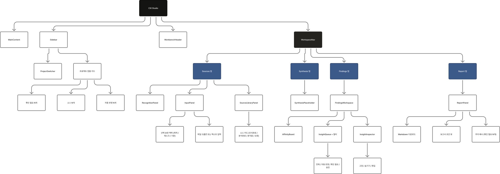
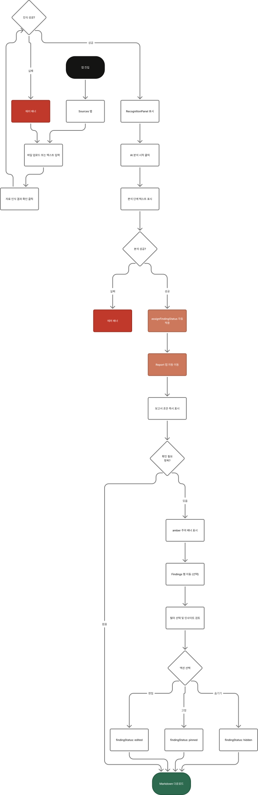
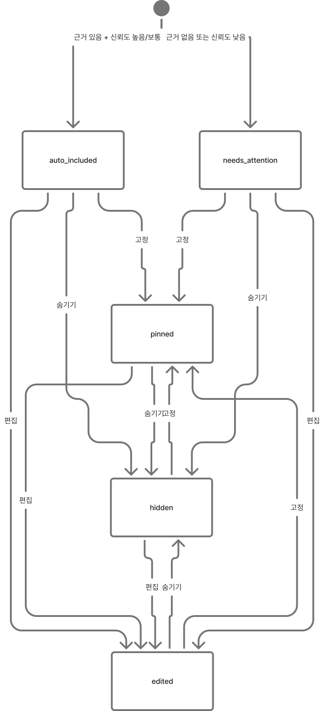

# CXI Studio — IA & UX Flow

> 기준 버전: `next-js` 브랜치 커밋 `18937c6` (2026-06-11)

---

## 0. FigJam 다이어그램

아래 이미지는 FigJam에서 생성한 도형 기반 시각 자료입니다. 클릭하면 FigJam에서 원본을 열 수 있습니다.

### Information Architecture

[](https://www.figma.com/board/AX3Ze3p1CJh9RVjpseYvLu)

### Main UX Flow

[](https://www.figma.com/board/PYJ48RX7q24ENrVbMBW6EZ)

### FindingStatus State Model

[](https://www.figma.com/board/QXTzvGPByDl9pJwzz3pYiC)

---

## 1. 제품 개요

**CXI Studio** (Customer Experience Intelligence Studio)는 UX 리서처가 인터뷰·설문·관찰 원자료를 올리면 AI가 발화를 파싱하고, 인사이트를 자동 분류하여 즉시 보고서 초안을 생성하는 워크벤치다.

**핵심 패러다임: 자동 반영 + 예외 처리**
- AI가 신뢰도·근거 기반으로 인사이트를 자동 보고서에 반영한다.
- 사용자는 "확인 필요" 항목만 선택적으로 검토한다.
- 분석이 완료되는 즉시 Report 탭이 열린다 (승인 게이트 없음).

---

## 2. 정보 구조 (IA)

```
CXI Studio
├── Sidebar (고정 좌측 패널)
│   ├── 브랜드 헤더 + 컬러칩
│   ├── 현재 프로젝트명 카드
│   ├── 상태 배지 ("자동 반영 N" | "초안")
│   ├── ProjectSwitcher
│   │   ├── 프로젝트 목록 (선택 / 삭제)
│   │   └── 새 프로젝트 만들기 버튼 (+)
│   └── 프로젝트 현황 카드
│       ├── 소스 N개
│       ├── 자동 반영 N개
│       └── 확인 필요 N개 (> 0이면 주황)
│
├── WorkbenchHeader (상단 고정)
│   ├── 상태 배지 그룹
│   │   ├── "CXI Studio" (amber)
│   │   ├── "리서치 워크벤치" (blue)
│   │   ├── 분석 상태 ("보고서 초안" | "자료 인식 완료" | "자료 대기")
│   │   └── 자동 저장 타임스탬프
│   ├── 헤드라인 + 컨텍스트 헬퍼 텍스트
│   ├── 보고서 다운로드 버튼
│   ├── 임시 저장 삭제 버튼
│   └── 보고서 반영 인사이트 카운터
│
├── WorkspaceNav (탭 내비게이션, 4-column)
│   ├── Sources      — 항상 활성
│   ├── Findings     — 분석 완료 후 활성
│   ├── Synthesis    — 분석 완료 소스 2개 이상일 때 활성
│   └── Report       — 분석 완료 후 즉시 활성
│
└── MainContent (탭별 컨텐츠 영역)
    ├── [Sources 탭]
    │   ├── InputPanel (자료 추가 카드)
    │   │   ├── 프로젝트명 / 세션·자료명 입력
    │   │   ├── 선택 보완 맥락 (연구 목적 / 평가 태스크 / 평가 기준)
    │   │   ├── 파일 드롭존 or 텍스트 직접 입력 (탭 전환)
    │   │   │   └── CSV/XLSX → TabularMappingPanel (컬럼 매핑)
    │   │   └── "자료 인식 결과 확인" 버튼
    │   ├── SourceLibraryPanel (소스 라이브러리)
    │   │   └── 소스 카드 목록 (인식 완료 / 분석완료 / 분석중 / 오류)
    │   │       ├── 개별 분석 / 다시 분석 버튼
    │   │       └── 삭제 버튼
    │   ├── RecognitionPanel (자료 인식 결과, 분석 전에만 표시)
    │   │   ├── 자료 유형, 세그먼트 수, 참가자 목록
    │   │   ├── 주요 주제 목록
    │   │   ├── 분석 정책 배지 목록
    │   │   └── 미리보기 세그먼트
    │   └── EmptyAnalysisState + "AI 분석 시작" 버튼 (분석 전)
    │
    ├── [Findings 탭]
    │   └── FindingsWorkspace
    │       ├── 인사이트 큐 (좌측 패널)
    │       │   ├── 헤더: "인사이트 결과가 자동으로 반영되었습니다"
    │       │   │         + 확인 필요 N개 서브텍스트 (> 0)
    │       │   ├── 필터 탭: 전체 / 자동 반영 / 확인 필요 / 숨김
    │       │   └── InsightCard 목록
    │       │       ├── FindingStatus 배지 (green/amber/muted)
    │       │       ├── RiskFlag 배지 ("근거 부족" | "일반화 주의" | "중복 가능성")
    │       │       ├── 인사이트 유형 배지
    │       │       ├── 제목 / 요약 (2줄 클램프)
    │       │       └── 영향도 / 빈도 / 신뢰도
    │       ├── InsightInspector (우측 패널)
    │       │   ├── 액션 버튼: 고정(BadgeCheck) / 숨기기(CircleSlash)
    │       │   ├── 인사이트 상세 (유형·영향도·빈도·신뢰도 배지)
    │       │   ├── 제목 / 유형 편집 필드
    │       │   ├── 맥락과 반복 패턴 텍스트에어리어
    │       │   ├── 영향도 / 빈도 / 신뢰도 편집 필드
    │       │   ├── 개선 제안 텍스트에어리어
    │       │   └── 근거 발화 (blockquote 목록, 최대 5개)
    │       └── AffinityBoard (주제별 발화 분류)
    │           ├── 주제 컬럼 목록 (최대 6개, 색상 팔레트)
    │           └── InsightReviewCard 목록 (각 주제 내)
    │               ├── FindingStatus / RiskFlag 배지
    │               ├── 제목 / 요약 / 개선 제안
    │               ├── 고정 / 숨기기 버튼
    │               └── 연결 발화 미리보기
    │
    ├── [Synthesis 탭]
    │   └── SynthesisPlaceholder
    │       ├── 소스 현황 메트릭 (전체 / 분석완료 / 필요 조건)
    │       └── "다음 구현 단계" 안내 텍스트
    │
    └── [Report 탭]
        └── ReportPanel
            ├── "확인 필요 N개" 주의 배너 (amber, attentionCount > 0)
            ├── 보고서 초안 뷰
            │   ├── 프로젝트명 / 메트릭 (자료명·반영 인사이트 수·자료 유형)
            │   ├── Executive Summary
            │   ├── 핵심 발견 (reportInsights 목록)
            │   └── Appendix
            ├── Markdown 다운로드 버튼
            └── 빈 상태: "분석이 완료되면 자동 반영 인사이트로 보고서 초안이 생성됩니다."

우측 고정 사이드 패널 (xl 이상)
    ├── ActionPanel
    │   ├── 분석 단계 프로그레스 텍스트
    │   └── "AI 분석 시작" / 재분석 버튼 (canAnalyze 조건)
    └── SupportPanel
        ├── 영향도·빈도 분포 차트
        └── 관련 태스크 목록
```

---

## 3. 상태 모델

### 3-1. 분석 세션 상태 (`DraftState`)

| 상태 키 | 설명 |
|--------|------|
| `activeProjectSlug` | 현재 선택된 프로젝트 slug |
| `recognition` | 자료 인식 결과 (`RecognitionResponse \| null`) |
| `result` | AI 분석 결과 (`AnalysisResponse \| null`) |
| `reviewedInsights` | 상태가 부여된 인사이트 배열 (`ReviewedInsight[]`) |
| `segmentTopicOverrides` | 사용자가 직접 이동시킨 발화의 주제 매핑 |

> LocalStorage 키: `cxi-studio:draft:v1` — 새로고침 후 복원됨.

### 3-2. 인사이트 상태 (`FindingStatus`)

| 값 | 의미 | 보고서 포함 |
|----|------|:-----------:|
| `auto_included` | AI가 신뢰도 기반으로 자동 반영 | ✓ |
| `pinned` | 사용자가 명시적으로 고정 | ✓ |
| `edited` | 사용자가 내용을 수정함 | ✓ |
| `needs_attention` | 근거 부족 또는 낮은 신뢰도 — 검토 권장 | ✗ |
| `hidden` | 사용자가 숨김 처리 | ✗ |

### 3-3. 자동 상태 할당 규칙 (`assignFindingStatus`)

```
supporting_quotes.length === 0  →  needs_attention + weak_evidence
confidence === "낮음"           →  needs_attention + overgeneralized
그 외                           →  auto_included (riskFlags = [])
```

### 3-4. 위험 플래그 (`RiskFlag`)

| 값 | 레이블 |
|----|--------|
| `weak_evidence` | 근거 부족 |
| `overgeneralized` | 일반화 주의 |
| `duplicate_candidate` | 중복 가능성 |

### 3-5. 소스 상태

`대기` → `분석중` → `분석완료` | `오류`

---

## 4. UX Flow

### 4-1. 신규 프로젝트 · 첫 분석 (단일 소스)

```
앱 진입 (Sources 탭)
  │
  ├─ [파일 모드] 파일 드롭 / 선택 (.txt .md .csv .xlsx)
  │   └─ CSV/XLSX → TabularMappingPanel 표시 (컬럼 자동 감지 + 수동 매핑)
  │
  ├─ [텍스트 모드] 원자료 직접 붙여넣기
  │
  ├─ 프로젝트명 / 세션·자료명 입력 (선택)
  ├─ 연구 목적 / 평가 태스크 / 평가 기준 입력 (선택)
  │
  ▼
"자료 인식 결과 확인" 클릭
  │
  └─ POST /api/parse(-upload)
     ├─ 성공 → RecognitionPanel 표시
     │         (발화 수·참가자·주제·분석 정책·미리보기)
     │   └─ "AI 분석 시작" 버튼 활성화
     └─ 실패 → 에러 배너
  │
  ▼
"AI 분석 시작" 클릭
  │
  └─ POST /api/analyze(-upload)
     ├─ 로딩: analysisStages 순환 텍스트 표시
     ├─ 성공 →
     │   ├─ reviewedInsights 할당 (assignFindingStatus 적용)
     │   ├─ WorkspaceTab → "report" (즉시 이동)
     │   └─ 사이드바: 자동 반영 N개 / 확인 필요 N개 업데이트
     └─ 실패 → 에러 배너
  │
  ▼
Report 탭 (분석 완료 즉시)
  ├─ attentionCount > 0이면 amber 배너 표시
  ├─ reportInsights로 구성된 보고서 초안 즉시 표시
  └─ Markdown 다운로드 버튼 활성화
```

### 4-2. Findings 탭 — 인사이트 검토

```
Findings 탭 이동
  │
  ├─ 큐 상단 필터: 전체 / 자동 반영 / 확인 필요 / 숨김
  │
  ├─ InsightCard 클릭 → InsightInspector 우측 패널 갱신
  │   ├─ 근거 발화 blockquote 확인
  │   ├─ 제목 / 요약 / 개선 제안 직접 편집 → findingStatus: "edited" 자동 설정
  │   └─ 액션 버튼
  │       ├─ "고정" → findingStatus: "pinned"  (보고서 포함 유지)
  │       └─ "숨기기" → findingStatus: "hidden" (보고서에서 제외)
  │
  └─ AffinityBoard (아래 영역)
      ├─ 주제별 발화 카드 확인
      └─ 카드 드래그 → 다른 주제 컬럼으로 이동 (segmentTopicOverrides 업데이트)
```

### 4-3. 멀티 소스 라이브러리 워크플로우

```
Sources 탭
  │
  ├─ 파일 드롭 후 인식 → "자료 인식 결과 확인"
  │   └─ 프로젝트 없으면 자동 생성 후 소스 라이브러리에 추가
  │
  ├─ SourceLibraryPanel에서 소스 카드 선택
  │   └─ "개별 분석" 버튼 클릭
  │       └─ POST /api/projects/{slug}/sources/{id}/analyze
  │           ├─ 분석중 상태 표시
  │           └─ 완료 → 소스 상태: "분석완료", 인사이트 수 배지 표시
  │
  ├─ 분석완료 소스 2개 이상 → Synthesis 탭 활성화
  │
  └─ 두 번째 소스 분석 완료 → 마지막 분석 결과로 Report 탭 이동
```

### 4-4. 기존 프로젝트 재진입

```
Sidebar → ProjectSwitcher에서 프로젝트 선택
  │
  └─ GET /api/projects/{slug}
     ├─ 프로젝트 메타데이터 복원 (목적·태스크·기준)
     ├─ 소스 라이브러리 로드
     ├─ 분석 결과·reviewedInsights 초기화
     └─ WorkspaceTab → "sources" (재진입은 항상 Sources 탭)
```

### 4-5. LocalStorage 초기화

```
WorkbenchHeader → "임시 저장 삭제" 클릭
  └─ confirm 없이 즉시 초기화
     ├─ LocalStorage 키 삭제
     ├─ 모든 상태 기본값 복원 (sampleText 포함)
     └─ WorkspaceTab → "sources"
```

---

## 5. 탭 활성화 조건

| 탭 | 활성 조건 | 비활성 시 |
|----|----------|---------|
| Sources | 항상 | — |
| Findings | `result !== null` | opacity 45%, disabled |
| Synthesis | 분석완료 소스 ≥ 2개 | opacity 45%, disabled |
| Report | `result !== null` | opacity 45%, disabled |

> Report는 **승인 게이트 없음** — 분석 완료 즉시 열린다.

---

## 6. 파생 상태 (derived state)

| 변수 | 계산식 | 용도 |
|------|--------|------|
| `reportInsights` | `findingStatus ∈ {auto_included, pinned, edited}` | 보고서 구성, Markdown 생성 |
| `attentionCount` | `findingStatus === "needs_attention"` count | 주의 배너, 사이드바, WorkspaceNav |
| `autoIncludedCount` | `findingStatus === "auto_included"` count | 사이드바 배지, WorkspaceNav |
| `reportMarkdown` | `buildReportMarkdown(...)` | 다운로드 버튼 활성화 |
| `canAnalyze` | `recognition && (file || text)` | AI 분석 버튼 활성화 |
| `canOpenReport` | `Boolean(result)` | Report 탭 활성화 |

---

## 7. API 엔드포인트 매핑

| 동작 | 메서드·경로 |
|------|-----------|
| 자료 인식 (텍스트) | `POST /api/parse` |
| 자료 인식 (파일) | `POST /api/parse-upload` |
| 분석 (텍스트) | `POST /api/analyze` |
| 분석 (파일) | `POST /api/analyze-upload` |
| 표 데이터 미리보기 | `POST /api/preview-tabular` |
| 프로젝트 목록 | `GET /api/projects` |
| 프로젝트 생성 | `POST /api/projects` |
| 프로젝트 조회 | `GET /api/projects/{slug}` |
| 프로젝트 삭제 | `DELETE /api/projects/{slug}` |
| 소스 목록 | `GET /api/projects/{slug}/sources` |
| 소스 업로드 | `POST /api/projects/{slug}/sources` |
| 소스 삭제 | `DELETE /api/projects/{slug}/sources/{id}` |
| 소스 개별 분석 | `POST /api/projects/{slug}/sources/{id}/analyze` |

---

## 8. 컴포넌트 트리 요약

```
Home (page root)
├── Sidebar
│   └── ProjectSwitcher
├── WorkbenchHeader
├── WorkspaceNav
└── MainContent
    ├── [sources] InputPanel
    │              ├── UploadedFileQueue
    │              └── TabularMappingPanel (CSV/XLSX)
    ├── [sources] SourceLibraryPanel
    ├── [sources] RecognitionPanel
    ├── [sources] EmptyAnalysisState
    ├── [findings] FindingsWorkspace
    │              ├── InsightCard 목록 (필터)
    │              ├── InsightInspector
    │              └── AffinityBoard
    │                  └── InsightReviewCard 목록
    ├── [synthesis] SynthesisPlaceholder
    ├── [report] ReportPanel
    ├── ActionPanel (우측 고정)
    └── SupportPanel (우측 고정)
```
